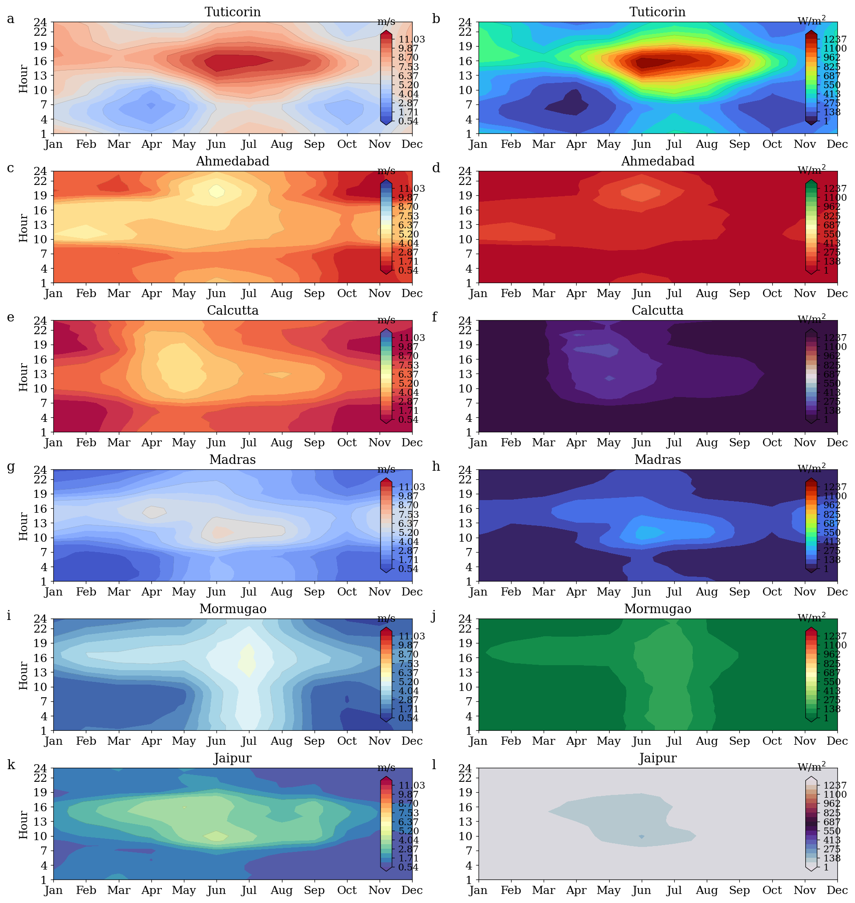

# WindPulse Documentation

This directory contains all documentation for the WindPulse project, configured for GitHub Pages.

## 📄 Documentation Pages

### Main Pages

- **[index.md](index.md)** - Project homepage with overview and key features
- **[methodology.md](methodology.md)** - Detailed methodology and algorithms used in the analysis
- **[results.md](results.md)** - Analysis results, findings, and statistical summaries
- **[gallery.md](gallery.md)** - Complete gallery of all 60 visualization outputs

### Configuration

- **[_config.yml](_config.yml)** - Jekyll configuration for GitHub Pages (Cayman theme)

### Setup Guide

- **[GITHUB_PAGES_SETUP.md](GITHUB_PAGES_SETUP.md)** - Complete guide for setting up and maintaining GitHub Pages

## 🌐 Live Site

Once GitHub Pages is enabled, the documentation will be available at:

**https://samsomyajit.github.io/windpulse/**

## 🚀 Quick Setup

1. Go to repository Settings → Pages
2. Select source: Branch `main`, folder `/docs`
3. Save and wait 1-2 minutes for deployment

See [GITHUB_PAGES_SETUP.md](GITHUB_PAGES_SETUP.md) for detailed instructions.

## 📝 Editing Documentation

### Format

All documentation is written in **Markdown** with YAML front matter:

```yaml
---
layout: default
title: Your Page Title
---

# Your Content Here
```

### Adding a New Page

1. Create `newpage.md` in this directory
2. Add front matter (see above)
3. Write content in Markdown
4. Add link to navigation in `index.md`
5. Commit and push

### Linking Between Pages

Use relative links:
```markdown
[Link text](otherpage.md)
```

### Including Images

Images are in the `../images/` directory:
```markdown

```

## 🎨 Theme

The site uses the **Cayman** theme from GitHub Pages themes. This provides:
- Clean, modern design
- Responsive layout
- GitHub-style navigation
- Automatic syntax highlighting

### Customizing Theme

To customize styles, create `assets/css/style.scss`:

```scss
---
---

@import "{{ site.theme }}";

/* Custom styles */
```

## 📊 Page Structure

### Homepage (index.md)
- Project overview
- Key features
- Quick start guide
- Navigation to other pages

### Methodology (methodology.md)
- Data collection process
- Analysis algorithms
- Statistical methods
- Implementation details

### Results (results.md)
- Key findings
- Statistical summaries
- Data tables
- Selected visualizations

### Gallery (gallery.md)
- All 60 images organized by category
- Collapsible sections for readability
- Image descriptions

## 🔧 Local Testing

To test documentation locally:

```bash
# Install Jekyll
gem install bundler jekyll

# In docs/ directory
bundle exec jekyll serve

# Visit http://localhost:4000/windpulse/
```

## 📋 Content Guidelines

### Writing Style
- Clear and concise
- Technical but accessible
- Use examples where helpful
- Include code snippets when relevant

### Formatting
- Use proper heading hierarchy (H1 → H2 → H3)
- Include table of contents for long pages
- Use code blocks with language specification
- Add horizontal rules (`---`) to separate sections

### Images
- Always include alt text
- Reference images by number and category
- Keep file sizes reasonable (< 1 MB)
- Use descriptive captions

## 🔍 SEO Optimization

The documentation is optimized for search engines:
- Descriptive titles and meta descriptions
- Proper heading structure
- Internal linking between pages
- Automatic sitemap generation

## 📦 Dependencies

The documentation uses:
- **Jekyll**: Static site generator
- **Cayman theme**: GitHub Pages theme
- **jekyll-relative-links**: Plugin for relative link handling

All are automatically provided by GitHub Pages - no manual installation needed.

## 🐛 Troubleshooting

### Common Issues

**404 errors**: Check that all files are in the `docs/` directory and paths are relative

**Images not showing**: Verify image paths start with `../images/` not `/images/`

**Changes not appearing**: Allow 1-2 minutes for GitHub Pages to rebuild

**Theme not applying**: Check `_config.yml` syntax and theme name

See [GITHUB_PAGES_SETUP.md](GITHUB_PAGES_SETUP.md) for detailed troubleshooting.

## 📈 Analytics

To add Google Analytics:

1. Get your tracking ID from Google Analytics
2. Add to `_config.yml`:
```yaml
google_analytics: UA-XXXXXXXXX-X
```

## 🔒 Privacy

The documentation is public and indexed by search engines. Don't include:
- Sensitive data
- Private API keys
- Confidential information
- Personal contact details

## 📚 Additional Resources

- [GitHub Pages Docs](https://docs.github.com/en/pages)
- [Jekyll Documentation](https://jekyllrb.com/docs/)
- [Markdown Guide](https://www.markdownguide.org/)
- [Cayman Theme GitHub](https://github.com/pages-themes/cayman)

## 🤝 Contributing

To improve documentation:

1. Edit the relevant `.md` file
2. Follow the content guidelines above
3. Test locally if possible
4. Submit a pull request

See [../CONTRIBUTING.md](../CONTRIBUTING.md) for detailed contribution guidelines.

## 📞 Support

For documentation issues:
- Open an issue: [GitHub Issues](https://github.com/Samsomyajit/windpulse/issues)
- Check existing documentation: [All docs](.)
- Review setup guide: [GITHUB_PAGES_SETUP.md](GITHUB_PAGES_SETUP.md)

---

**Last updated**: January 2026

**Maintainer**: Samsomyajit

**License**: Apache License 2.0 (see [../LICENSE](../LICENSE))
